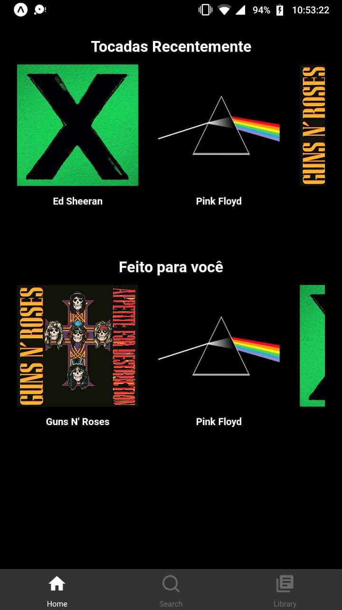
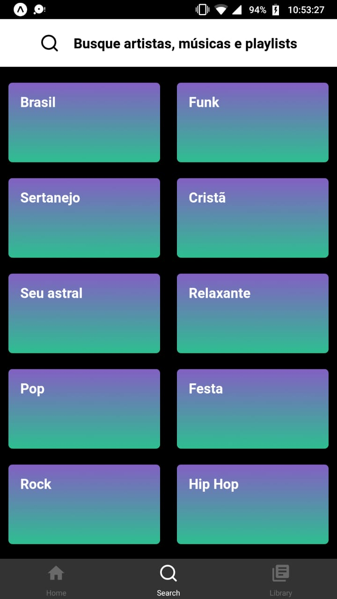
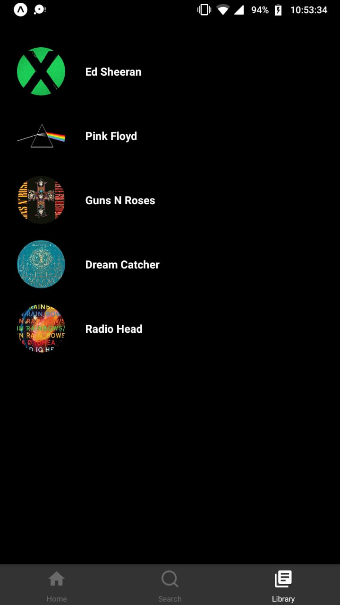

# Spotify Clone

A Spotify mobile app UI clone.

## Made with

* [Expo](https://expo.io/)
* [LinearGradient](https://docs.expo.io/versions/latest/sdk/linear-gradient/)
* [React Native](https://reactnative.dev/)
* [React Navigation](https://reactnavigation.org/)
* [Visual Studio Code](https://code.visualstudio.com/)

## Screenshots

<center>
<span>



</span>
</center>

## How to use

```bash
# Clone this repository
git clone https://github.com/fredcoutinho52/spotify-clone.git

# Install depedencies
npm install

# Run the app
npm start
```
